# 블록코딩

PiBrain 메이커는 Blockly 기반의 블록 코딩을 지원합니다. 기본 블록 외에 PiBrain을 쉽게 쓸 수 있도록
**openpibo** 파이썬 패키지와 이어진 블록이 있습니다. 블록 코드는 [파이썬 코드] 버튼으로 파이썬으로 볼 수 있습니다.

```{note}
이 페이지는 IDE 툴박스에서 자동으로 만들었습니다(`docs/tools/gen_block_guide.py`). 블록 그림은 툴박스에서 꺼냈을 때의 기본값입니다.
모든 기능은 **PiBrain 안에서** 돌아가며 인터넷이 필요한 것은 [수집] 분류뿐입니다.
```

## 블록 구성

```
Blockly 기본 블록 (Blockly 공식 블록 — 설명은 블록에 마우스를 올리면 나옵니다)
├── 논리 (7)
├── 반복 (5)
├── 수학 (13)
├── 문자 (15)
├── 목록 (12)
├── 색상 (4)
├── 변수 (만들면 생김)
└── 함수 (만들면 생김)

PiBrain 전용 블록
├── 시작 (1)
├── 소리 (3)
├── 수집 (4)
├── 장치 (7)
├── 화면 (11)
├── 음성 (7)
├── 시각 (16)
├── 인식 (35)
└── 도구 (12)
```

## PiBrain 전용 블록

### 시작


코드를 실행합니다.

### 소리

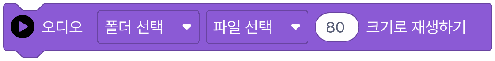

음악 파일을 골라서 원하는 소리 크기로 재생합니다.

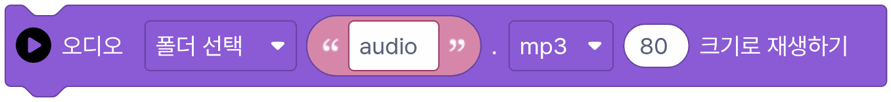

음악 파일 이름을 적어서 소리를 재생합니다.


재생 중인 소리를 멈춥니다.

### 수집


(인터넷 필요!) 위키피디아에서 입력한 내용을 찾아줍니다. *값을 돌려주는 블록*


(인터넷 필요!) 선택한 지역의 날씨 정보를 가져옵니다. *값을 돌려주는 블록*


(인터넷 필요!) 선택한 지역의 특정 날씨 정보를 찾아줍니다. *값을 돌려주는 블록*


(인터넷 필요!) 뉴스에서 입력한 내용을 검색합니다. *값을 돌려주는 블록*

### 장치

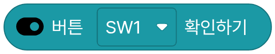

버튼이 눌렸는지 확인합니다. *값을 돌려주는 블록*

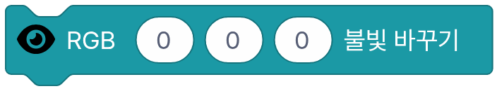

불빛의 색을 변경합니다.

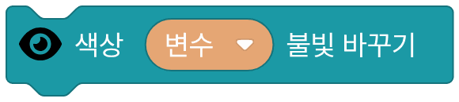

색상 변수를 사용해 불빛의 색을 변경합니다.

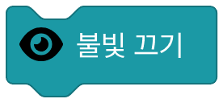

불빛을 끕니다.

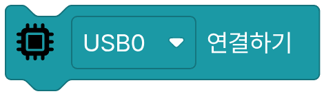

USB 장치 연결합니다.

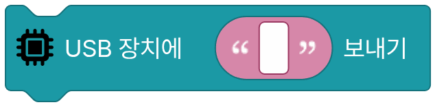

USB 장치에 메시지를 보냅니다

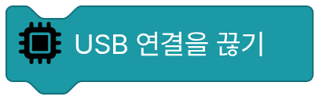

USB 연결 해제합니다.

### 화면

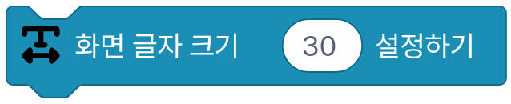

화면에 보이는 글자 크기를 설정합니다.

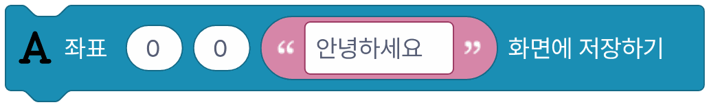

화면에 글자를 저장합니다.

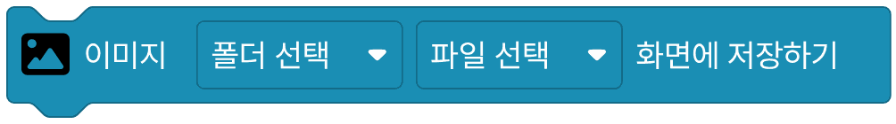

화면에 선택한 이미지를 저장합니다.

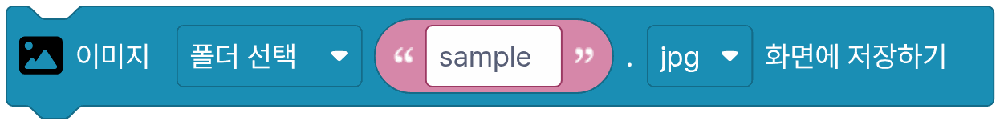

화면에 입력한 이미지를 저장합니다.

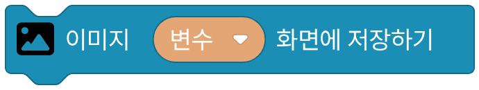

화면에 이미지 변수를 저장합니다.

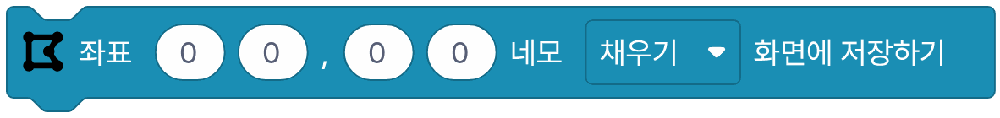

화면에 네모를 저장합니다.

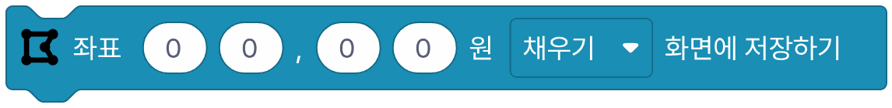

화면에 원을 저장합니다.

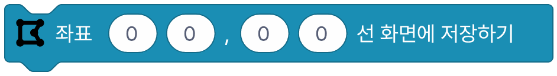

화면에 선을 저장합니다.

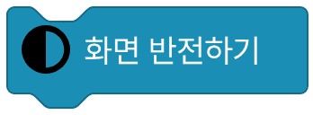

화면의 색을 반전합니다.

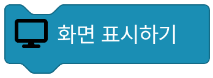

화면에 저장된 내용을 표시합니다.

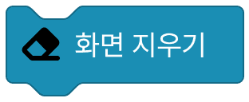

화면을 초기화합니다.

### 음성

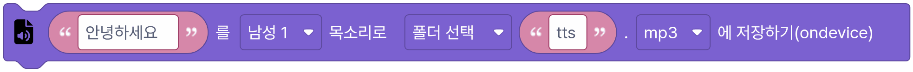

입력한 글자를 파이보 안에서 목소리로 만들어 파일로 저장합니다. 한국어·영어는 자동으로 알아봅니다.

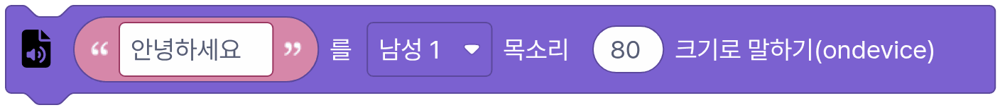

입력한 글자를 파이보 안에서 목소리로 만들어 말합니다. 한국어·영어는 자동으로 알아봅니다.

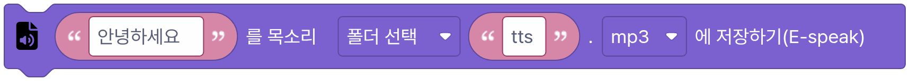

입력한 글자를 espeak 기계 목소리로 파일에 저장합니다.

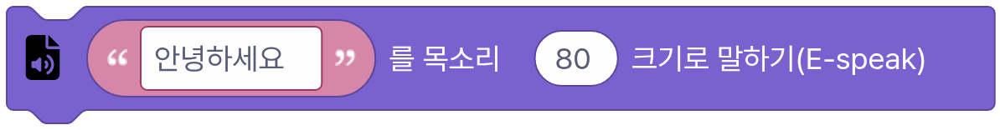

입력한 글자를 espeak 기계 목소리로 말합니다.

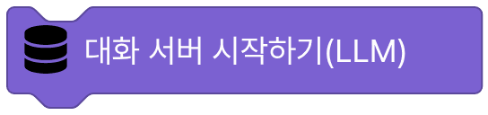

대화 서버를 시작합니다.


대화 서버(LLM)에 글을 보내고 대답을 받습니다. 역할에는 파이보가 어떤 말투·역할로 대답할지 적습니다. *값을 돌려주는 블록*

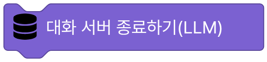

대화 서버를 끕니다.

### 시각

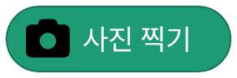

카메라로 사진을 찍습니다. *값을 돌려주는 블록*

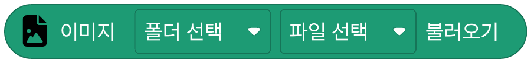

선택한 이미지 파일을 불러옵니다. *값을 돌려주는 블록*

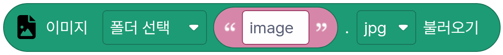

입력한 이미지 파일을 불러옵니다. *값을 돌려주는 블록*

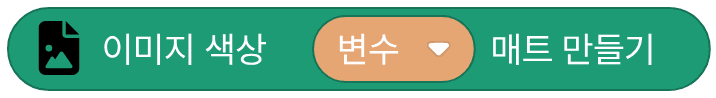

고른 색으로 채운 빈 이미지를 만듭니다. *값을 돌려주는 블록*

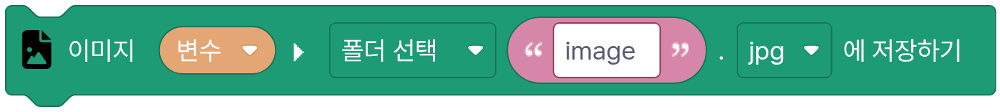

이미지를 파일로 저장합니다.

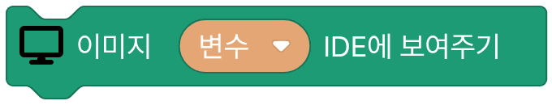

이미지 변수를 IDE에서 보여줍니다.

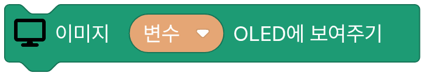

이미지 변수를 OLED에서 보여줍니다.

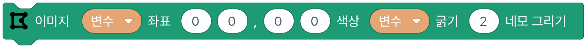

이미지에 네모를 그립니다.

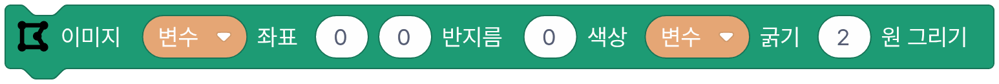

이미지에 동그라미를 그립니다.

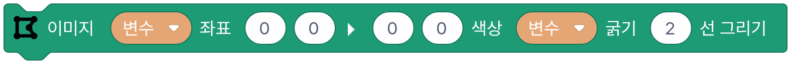

이미지에 선을 그립니다.

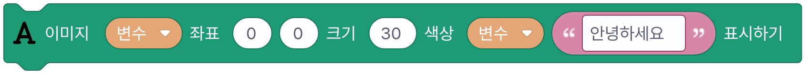

이미지에 글자를 표시합니다.


이미지의 스타일을 바꿉니다. *값을 돌려주는 블록*


이미지 크기를 바꿉니다. *값을 돌려주는 블록*

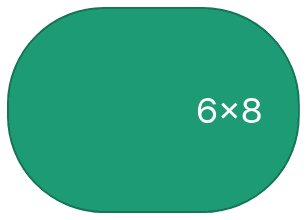

점을 눌러 그린 6×8 그림을 이미지로 만듭니다(카메라 화면 크기로 키움). *값을 돌려주는 블록*

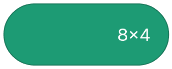

점을 눌러 그린 8×4 그림을 이미지로 만듭니다(카메라 화면 크기로 키움). *값을 돌려주는 블록*


점을 눌러 그린 8×8 그림을 이미지로 만듭니다(카메라 화면 크기로 키움). *값을 돌려주는 블록*

### 인식


이미지에서 얼굴을 찾습니다. *값을 돌려주는 블록*

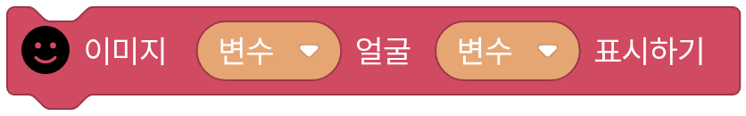

이미지에서 얼굴을 표시합니다.


이미지에서 얼굴을 분석합니다.(나이,성별,감정) *값을 돌려주는 블록*

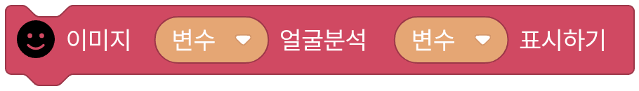

이미지에서 얼굴분석 결과 표시합니다.


이미지에서 얼굴의 랜드마크를 찾습니다. *값을 돌려주는 블록*

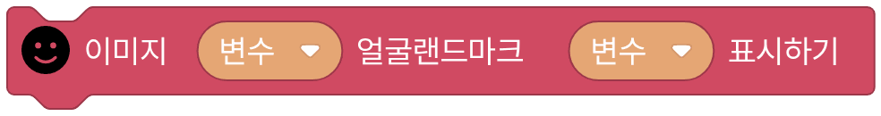

이미지에서 얼굴의 랜드마크 표시합니다.


얼굴 사전에 학습된 이름 목록을 가져옵니다. *값을 돌려주는 블록*

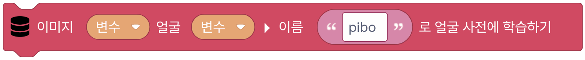

이미지에서 얼굴을 이름으로 학습합니다.

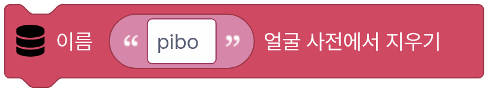

학습된 얼굴 데이터에서 특정 이름을 삭제합니다.


이미지에서 얼굴이 누구인지 인식합니다. *값을 돌려주는 블록*


학습된 얼굴 데이터를 파일로 저장합니다.

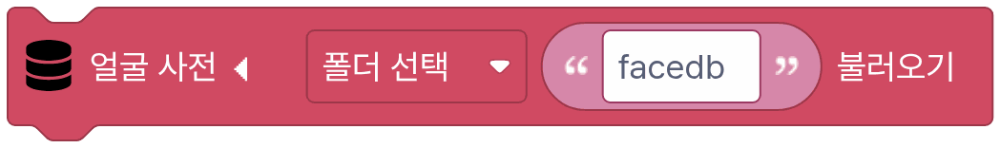

저장된 얼굴 학습 파일을 불러옵니다.


인식된 얼굴의 방향과 거리를 분석합니다. *값을 돌려주는 블록*

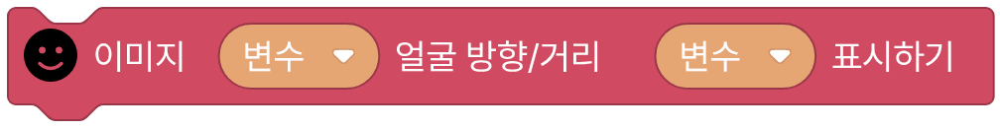

인식된 얼굴의 방향과 거리를 표시합니다.

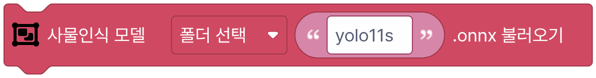

사물인식 모델을 불러옵니다.(yolo)


이미지에서 사물을 찾아냅니다. (80개 종류의 사물) *값을 돌려주는 블록*


이미지에서 사물을 찾아냅니다. (80개 종류의 사물) - RAW *값을 돌려주는 블록*


이미지에서 사물을 표시합니다. (80개 종류의 사물)

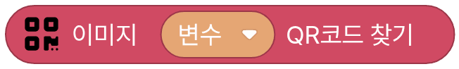

이미지에서 QR코드를 찾아냅니다. *값을 돌려주는 블록*


이미지에서 QR코드를 찾아냅니다.(RAW) *값을 돌려주는 블록*

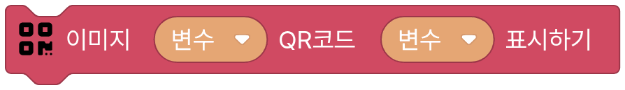

이미지에서 QR코드를 표시합니다.


이미지에서 사람의 포즈 데이터를 가져옵니다. (17개 좌표) *값을 돌려주는 블록*

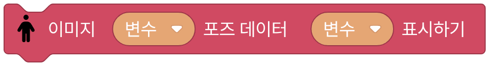

이미지에서 사람의 포즈 데이터를 표시합니다.


포즈 데이터를 분석해 정해진 포즈를 알아냅니다. *값을 돌려주는 블록*


이미지의 특정 위치에 트래커를 설정합니다.


설정된 트래커로 이미지를 추적합니다. *값을 돌려주는 블록*


추적 결과를 표시합니다.


내장된 손 동작 모델을 불러옵니다.


손 동작 모델을 불러옵니다.


이미지에서 손 동작을 인식합니다. *값을 돌려주는 블록*


이미지에서 손 동작을 표시합니다.


이미지에서 마커를 인식합니다. *값을 돌려주는 블록*


이미지에서 마커를 표시합니다.


분류기 화면에서 가르치고 저장한 모델을 불러옵니다. 폴더는 mymodel, 칸에 모델 이름을 적습니다. (이미지·손·얼굴·포즈)


불러온 분류기 모델로 이미지를 분류해 가장 알맞은 이름을 돌려줍니다. 손·얼굴·포즈 모델은 화면에 손·얼굴·몸이 안 보이면 빈 글자를 돌려줍니다. *값을 돌려주는 블록*

### 도구


정해진 시간 동안 멈춥니다.


현재 시간 값을 가져옵니다. *값을 돌려주는 블록*


지금의 시간을 확인합니다. *값을 돌려주는 블록*


항목이 리스트 안에 있는지 확인합니다. *값을 돌려주는 블록*


사전에서 정해진 키에 해당하는 값을 가져옵니다. *값을 돌려주는 블록*


사전에 정해진 키와 값을 추가합니다.


빈 사전을 만듭니다. *값을 돌려주는 블록*


리스트의 지정된 범위 값을 저장합니다.


파일이나 폴더가 있는지 확인합니다. *값을 돌려주는 블록*


변수의 타입을 글자형으로 바꿉니다. *값을 돌려주는 블록*


변수의 타입을 숫자형(정수 또는 소수)으로 바꿉니다. *값을 돌려주는 블록*


세 점 사이의 각도 구하기 *값을 돌려주는 블록*
