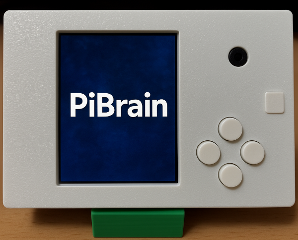

# 하드웨어

파이브레인 부품에 관한 세부적인 설명을 다룹니다.

- 카메라
   - Raspberrypi Camera v1.3과 호환되는 카메라입니다.
   - 5 Megapixel로 촬영이 가능합니다.

- 버튼
   - Tach Switch 이고, Unlock 타입
   - 4개가 연결되어 있습니다.

- LCD
   - 240 x 320 해상도, 2.4 인치 LCD 입니다
   - SPI 연결 방식을 사용합니다.

- LED
   - WS281x Neopixel LED를 사용합니다.

- Audio
   - I2S 방식의 앰프가 내장되어 있습니다.
   - 1W 스피커가 내장되어 있습니다.

- Main controller
   - Raspberry PI 를 사용합니다.
