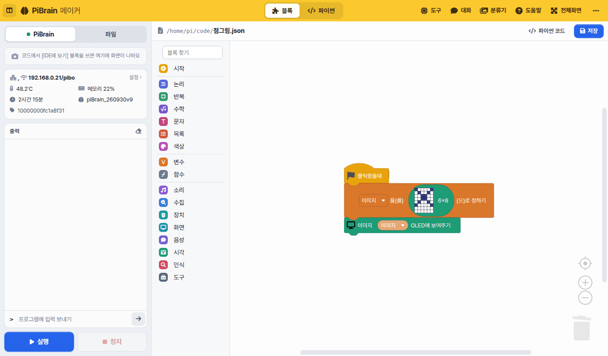
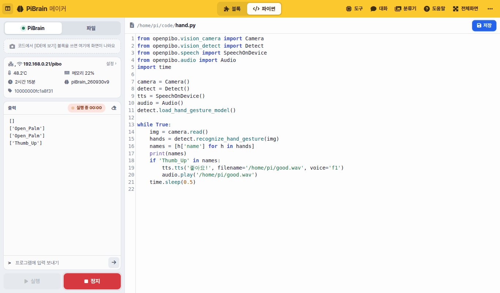
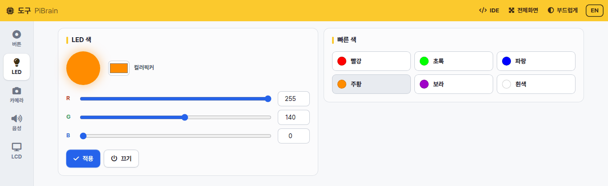
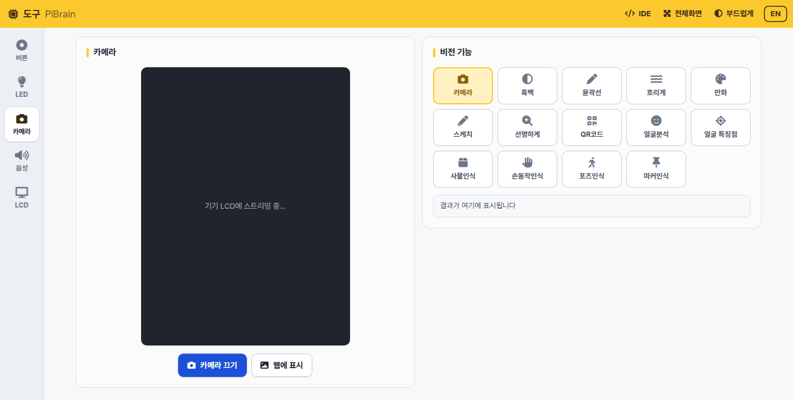
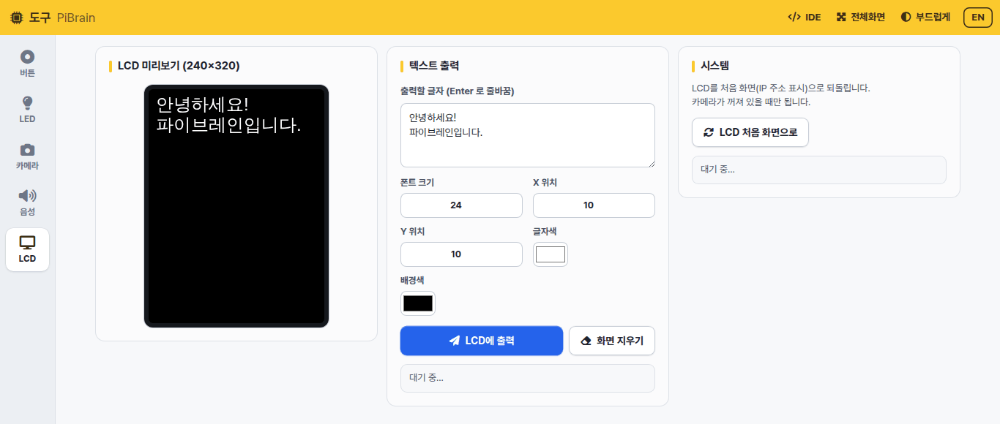
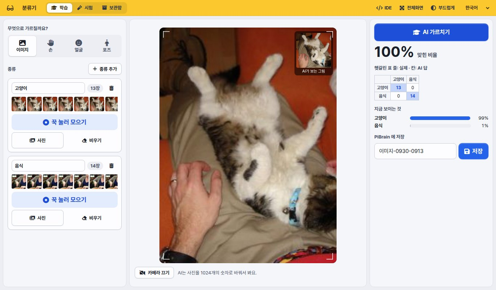

# PiBrain 메이커

PiBrain 메이커는 브라우저로 여는 PiBrain 개발 환경입니다. 태블릿·노트북이 PiBrain 과 같은 WiFi 에 붙어 있으면
주소창에 **PiBrain 의 IP 주소**(LCD 첫 화면에 나옵니다)를 적어 엽니다. 설치할 것은 없습니다.

| 화면 | 하는 일 | 여는 곳 |
|---|---|---|
| **IDE** | 블록·파이썬으로 프로그램을 만들고 실행합니다 | `http://<PiBrain IP>` |
| **도구** | 버튼·LED·카메라·목소리·LCD 를 코드 없이 바로 써 봅니다 | IDE 위 [도구] |
| **대화** | PiBrain 안의 언어 모델(LLM)과 글로 대화합니다 | IDE 위 [대화] |
| **분류기** | 카메라로 예시를 모아 나만의 AI 를 가르칩니다 | IDE 위 [분류기] |
| **도움말** | 지금 보고 있는 이 문서입니다 | IDE 위 [도움말] |

```{note}
모든 기능은 **PiBrain 안에서** 돌아갑니다(목소리 만들기·대화·분류기 포함). 인터넷이 필요한 것은
블록 [수집] 분류(위키백과·날씨·뉴스)뿐입니다.
```

## IDE



- **위 줄**: [블록 | 파이썬] 으로 편집기를 바꿉니다. 오른쪽은 도구·대화·분류기·도움말·전체화면과 [⋯] 더보기
  (화면 밝기 · 글자 크기 · 파이썬 편집기 테마 · 언어 · 초기화 · 전원 · 소스 코드와 라이선스)
- **왼쪽 패널**: 아래의 **[실행] [정지]** 는 늘 보입니다.
  - [PiBrain] — 화면 출력(`IDE에 보여주기` 블록으로 보낸 그림), 상태(WiFi·온도·메모리·켜진 시간·버전), 실행 출력, 프로그램에 입력 보내기
  - [파일] — 파일 목록, 새 파일·새 폴더·올리기, 사진·소리 미리보기
- **블록**: 왼쪽 분류에서 블록을 끌어다 놓습니다. 맨 위 **블록 찾기** 에 '소리'·'얼굴' 처럼 적으면 해당 블록이 나옵니다.
  [파이썬 코드] 를 누르면 블록이 만든 파이썬 코드를 볼 수 있습니다. 블록 목록은 왼쪽 **BLOCK** 을 보세요.



- **파이썬**: `openpibo` 패키지로 PiBrain 의 기능을 씁니다. `print` 는 왼쪽 [출력] 에, `input` 은 [입력] 칸으로 받습니다.
  API 는 왼쪽 **PYTHON** 을 보세요
- 실행한 프로그램은 PiBrain 안에서 돕니다. 멈추려면 [정지] 를 누릅니다

## 도구

PiBrain 의 기능을 하나씩 코드 없이 써 봅니다. 왼쪽 메뉴에서 [버튼] [LED] [카메라] [음성] [LCD] 를 고릅니다.

- **버튼**: 버튼 4개가 눌렸는지 실시간으로 보여 줍니다



- **LED**: 색을 골라 [적용] 하면 LED 가 그 색으로 켜집니다



- **카메라**: [카메라 켜기] 를 누르면 카메라 화면이 **PiBrain LCD** 에 나옵니다. 비전 기능(흑백·윤곽선·만화·QR코드·얼굴분석·
  사물인식·손동작인식·포즈인식·마커인식 등)을 누르면 LCD 화면에 바로 적용되고, 결과는 오른쪽 아래에 글자로 나옵니다.
  [웹에 표시] 를 누르면 지금 화면을 브라우저에서도 봅니다
- **음성**: 목소리 10가지(남성 1~5, 여성 1~5) 중에서 골라 글자를 말하게 합니다. 한국어·영어는 자동으로 알아봅니다



- **LCD**: 글자·크기·위치·색을 정해 LCD(240×320)에 띄웁니다. [LCD 처음 화면으로] 는 IP 주소가 나오는 첫 화면으로 되돌립니다

## 분류기



카메라로 예시를 모아 AI 에게 '이건 고양이, 이건 음식' 처럼 가르칩니다. PiBrain 카메라는 세로(3:4)라 화면도 세로로 나옵니다.

1. **무엇으로 가르칠까요?** — 이미지(사진 전체) · 손(손 모양) · 얼굴(표정) · 포즈(몸 자세) 중에서 고릅니다
2. **종류** 마다 이름을 적고 **[꾹 눌러 모으기]** 를 누르고 있는 동안 예시가 모입니다. [사진] 으로 파일을 올려도 됩니다
3. **[AI 가르치기]** — 태블릿·노트북 브라우저에서 몇 초 만에 배웁니다. 맞힌 비율·헷갈린 표·지금 보이는 것의 점수가 나옵니다
4. **[저장]** — PiBrain 의 `/home/pi/mymodel/<모델 이름>` 에 저장됩니다
5. IDE 에서 블록 `분류기 모델 [mymodel] (모델 이름) 불러오기` → `분류기 모델로 (이미지) 분류하기` 로 씁니다

[시험] 탭에서 저장한 모델을 다시 써 보고, [보관함] 에서 시험·이어서 배우기·이름 바꾸기·내려받기(zip)·삭제를 합니다.

```{tip}
분류기는 처음 열 때 AI 파일(약 10MB)을 받습니다. 수업 전에 태블릿마다 한 번씩 열어 두면 수업 중에는 바로 뜹니다.
```

## 대화

PiBrain 안에서 도는 언어 모델(LLM)과 글로 대화합니다. 블록 [음성] 의 `대화 서버 시작하기` · `… 대화하기` 로
프로그램에서도 씁니다. 모델을 올리는 데 시간이 걸려서 처음 열면 준비될 때까지 기다리는 화면이 먼저 나옵니다.

```{note}
도구·대화·분류기는 **한 번에 하나만** 켜집니다. 하나를 열면 나머지는 꺼지고, IDE 에서 프로그램을 실행해도 꺼집니다
(카메라·스피커·메모리를 나눠 쓰기 때문입니다). 꺼진 화면에는 [다시 켜기] 가 나옵니다.
```
