# Block coding

PiBrain Maker uses Blockly for block coding. Besides the standard blocks there are PiBrain blocks that call
the **openpibo** Python package. The [Python code] button shows the Python code your blocks make.

```{note}
This page is generated from the IDE toolbox (`docs/tools/gen_block_guide.py`). Each picture shows the block as it comes out of the toolbox.
Everything runs **inside PiBrain**. Only the [Collect] category needs the internet, and it is only in the Korean edition.
```

## Categories

```
Standard Blockly blocks (hover over a block to see what it does)
├── Logic (7)
├── Loops (5)
├── Math (13)
├── Text (15)
├── Lists (12)
├── Colour (4)
├── Variables (appear when you make one)
└── Functions (appear when you make one)

PiBrain blocks
├── Start (1)
├── Audio (3)
├── Collect (4)
├── Device (7)
├── Oled (11)
├── Speech (7)
├── Vision (16)
├── Rec (36)
└── Utils (12)
```

## PiBrain blocks

### Start


Run the code.

### Audio


Select and play audio at set volume.


Enter music file name to play.


Stop the audio currently playing.

### Collect

```{note}
Korean edition only (Korean weather regions and a Korean news feed). The Global edition does not have this category.
```


(Internet!) Search Wikipedia with the given keyword. *returns a value*


(Internet!) Search for comprehensive weather information in a specific area. *returns a value*


(Internet!) Search for weather information in a specific area. *returns a value*


(Internet!) Retrieve search results with news keywords. *returns a value*

### Device


Check button status. *returns a value*


Turn on LED


Turn on LED with a color variable.


Turn off LED

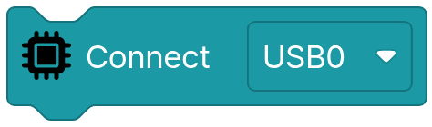

Connect USB Device.

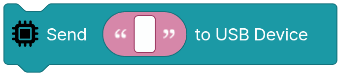

Send message to USB Device.

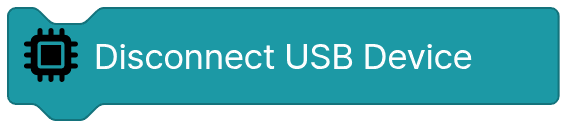

Disconnect USB Device.

### Oled


Set the font size on the OLED display.

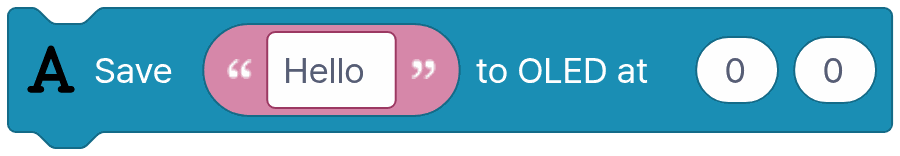

Display text on the OLED screen.


Display dynamically selected image on OLED.


Display a specified image on OLED.


Display a specified image data on OLED.

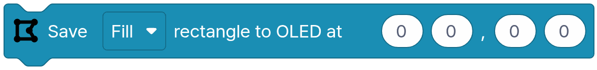

Draw a rectangle on OLED.

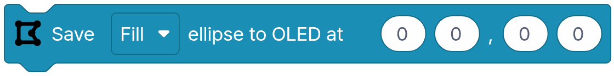

Draw an ellipse on OLED.

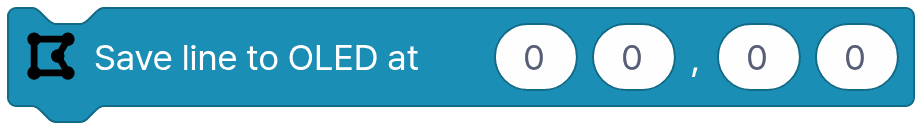

Draw a line on OLED.


Invert colors on the OLED screen.


Display content on OLED screen.


Clear the OLED screen.

### Speech


Make speech on the robot and save it to a file. Korean and English are detected automatically.


Make speech on the robot and say it. Korean and English are detected automatically.


Save text as espeak robot voice to a file.


Say text with the espeak robot voice.


Start LLM server.


Send text to the LLM server and get a reply. The system prompt sets how piBo should answer. *returns a value*


Stop the LLM server.

### Vision


Capture an image. *returns a value*


Load a specified image file. *returns a value*


Load an image file. *returns a value*


Create a blank image filled with the chosen color. *returns a value*

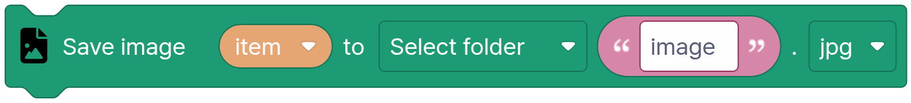

Save as an image file.


Display an image variable in IDE.


Display an image variable in OLED.


Draws a rectangle on the image.


Displays a circle in the image.


Displays a line in the image.

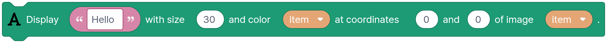

Display text on the image.


Transform image style. *returns a value*


Resize the image. *returns a value*


Turns the 6×8 picture you draw by tapping dots into an image (scaled to the camera size). *returns a value*


Turns the 8×4 picture you draw by tapping dots into an image (scaled to the camera size). *returns a value*

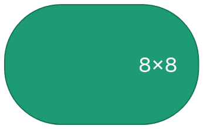

Turns the 8×8 picture you draw by tapping dots into an image (scaled to the camera size). *returns a value*

### Rec


Detect and identify faces in the specified image. *returns a value*


Show faces in the image.


Analyze face in image(age, gender, emotion) *returns a value*


Show face analysis in the image


Find face landmark in the image *returns a value*


Show face landmark in the image.


Get the list of names in the face dictionary. *returns a value*


Train face from image.


Delete a specific face from training faces.


Recognize who faces are in an image. *returns a value*


Save face training data to file.


Load face training data from file.


Analyze face direction/distance in the image. *returns a value*


Show face direction/distance in the image


Load Object detection model


Find objects in the image. *returns a value*


Find objects in the image. (RAW) *returns a value*


Show objects in the image.


Find QR in the image. *returns a value*


Find QR in the image. (RAW) *returns a value*


Show QR codes in the image.


Identify and analyze human poses in the specified image. *returns a value*


Show pose data in the image.


Evaluate and interpret pose data from the image and save the results. *returns a value*


Set a tracker for a specific location in the image.


Track thing in the image. *returns a value*


Show tracking result in the image.


Load Hand gesture model.


Load Hand gesture model


Recognize Hand gesture in the image. *returns a value*


Show hand gesture in the image.


Detect Marker in the specified image. *returns a value*


Show marker in the image.


Load a model you taught and saved in the Classifier. Folder mymodel, then the model name. (image, hand, face, pose)


Classify the image with the loaded classifier model and return the best matching name. Hand, face and pose models return empty text when no hand, face or body is in view. *returns a value*

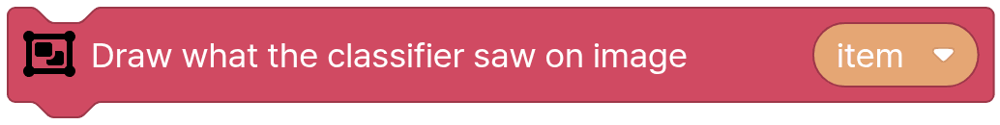

Draws what the last [Classify with classifier model] saw on that image: points and bones for hand and pose, points for face, plus the class name and probability.

### Utils


Pause the process for a specified duration of seconds.


Retrieve the current time value. *returns a value*


Obtain the current time. *returns a value*


Verify if an element is included in a list or array. *returns a value*


Retrieve the value associated with a specific key in a dictionary. *returns a value*


Add a new key-value pair to an existing dictionary.


Generate a new empty dictionary. *returns a value*


Set the values of the specified range in the array.


Confirm the existence of a file or directory. *returns a value*


Change a variable's type to String. *returns a value*


Convert a variable to a specific numeric type. (Integer or Float) *returns a value*


Get angle *returns a value*
