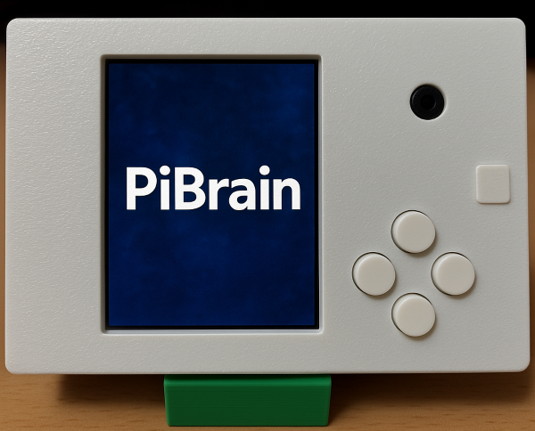

# Hardware

Details of the parts of PiBrain.

- Camera
   - A camera compatible with the Raspberry Pi Camera v1.3.
   - Takes 5-megapixel pictures.

- Buttons
   - Tact switches, non-locking type
   - 4 buttons are connected.

- LCD
   - 2.4-inch LCD, 240 x 320 resolution
   - Connected over SPI.

- LED
   - Uses WS281x Neopixel LEDs.

- Audio
   - Built-in I2S amplifier.
   - Built-in 1 W speaker.

- Main controller
   - Uses a Raspberry Pi.
