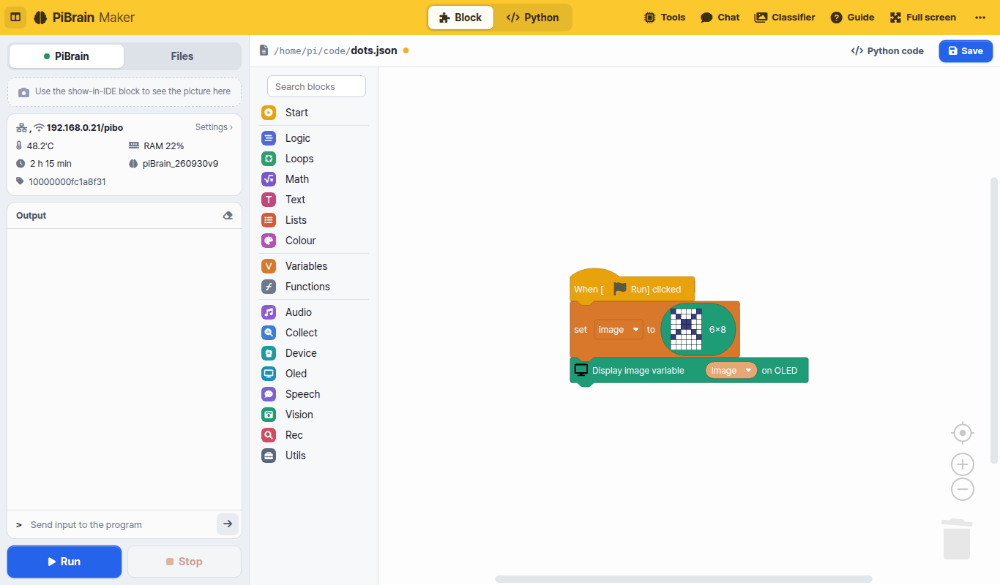
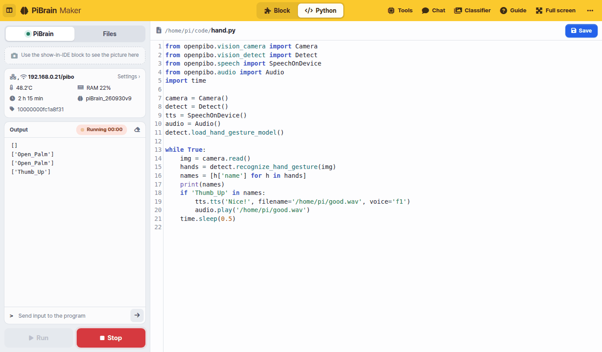
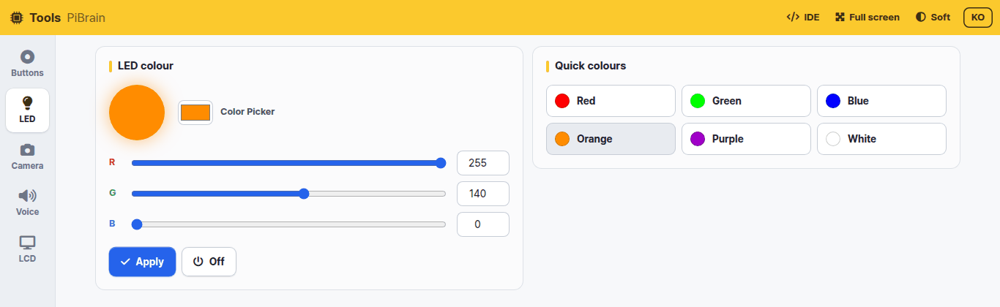
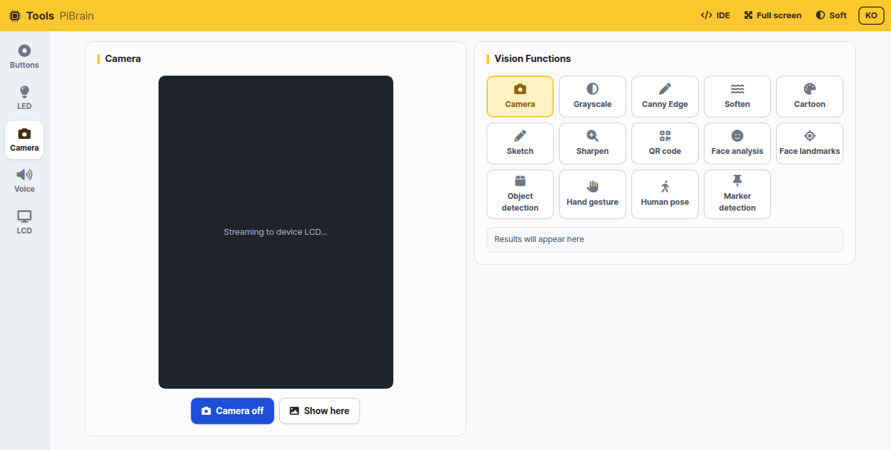
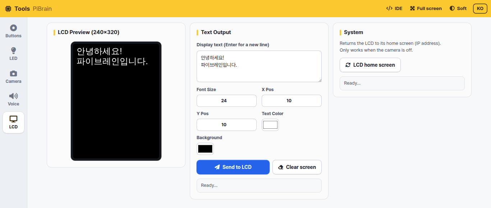
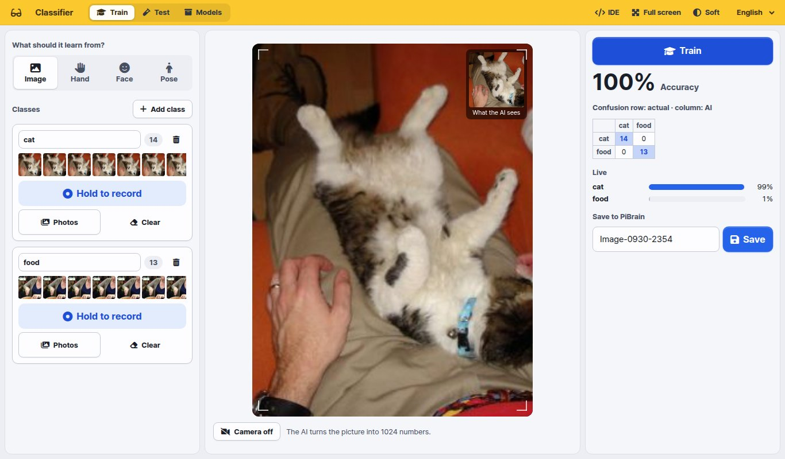

# PiBrain Maker

PiBrain Maker is the PiBrain development environment you open in a web browser. When your tablet or laptop is on the same WiFi
as PiBrain, type **PiBrain's IP address** (shown on the first LCD screen) into the address bar. There is nothing to install.

| Screen | What it does | Where to open it |
|---|---|---|
| **IDE** | Build and run programs with blocks or Python | `http://<PiBrain IP>` |
| **Tools** | Try the buttons, LED, camera, voice and LCD right away, without code | [Tools] at the top of the IDE |
| **Chat** | Chat in text with the language model (LLM) running inside PiBrain | [Chat] at the top of the IDE |
| **Classifier** | Collect examples with the camera and teach your own AI | [Classifier] at the top of the IDE |
| **Guide** | This document | [Guide] at the top of the IDE |

```{note}
Everything runs **inside PiBrain** (voices, chat and the classifier included). Only the blocks in the
[Collect] category (Wikipedia, weather, news) need the internet, and that category is only in the Korean edition.
```

## IDE



- **Top bar**: switch the editor with [Block | Python]. On the right are Tools, Chat, Classifier, Guide, Full screen and [⋯] More
  (brightness · font size · Python editor theme · language · reset · power · source code and license)
- **Left panel**: **[Run] [Stop]** at the bottom are always visible.
  - [PiBrain] — screen output (pictures sent with the `Display image variable … on IDE` block), status (WiFi, temperature, memory, uptime, version), program output, sending input to the program
  - [Files] — the file list, new file / new folder / upload, and a preview for pictures and sounds
- **Blocks**: drag blocks out of the categories on the left. Type a word such as "sound" or "face" into **Search blocks** at the top
  to find blocks. [Python code] shows the Python code your blocks make. See **Blocks** on the left for every block.



- **Python**: the `openpibo` package gives you every PiBrain feature. `print` goes to [Output] on the left and `input` reads from the input box.
  See **Python** on the left for the API
- Programs run inside PiBrain. Press [Stop] to stop one

## Tools

Try PiBrain's features one at a time, without code. Pick [Buttons], [LED], [Camera], [Voice] or [LCD] on the left.

- **Buttons**: shows live whether each of the 4 buttons is pressed



- **LED**: pick a colour and press [Apply] to light the LED in that colour



- **Camera**: press [Camera on] to show the camera view on the **PiBrain LCD**. Tap a vision feature (grayscale, edges, cartoon, QR code,
  face analysis, object detection, hand gestures, pose, markers…) to apply it to the LCD view right away; the result appears as text at the bottom right.
  [Show here] shows the current view in the browser too
- **Voice**: pick one of ten voices (Male 1–5, Female 1–5) and let PiBrain say your text. Korean and English are detected automatically



- **LCD**: choose the text, size, position and colour and show it on the LCD (240×320). [LCD home screen] goes back to the first screen with the IP address

## Classifier



Collect examples with the camera and teach the AI, for example "this is a cat, this is food". The PiBrain camera is portrait (3:4), so the view is portrait too.

1. **What should it learn from?** — Image (the whole picture) · Hand (hand shape) · Face (expression) · Pose (body posture)
2. Name each **class** and keep pressing **[Hold to record]** to collect examples. You can also upload files with [Photos]
3. **[Train]** — the tablet or laptop browser learns in a few seconds and shows the accuracy, a confusion table and live scores
4. **[Save]** (under Save to PiBrain) — saved on PiBrain in `/home/pi/mymodel/<model name>`
5. In the IDE use `Load classifier model (mymodel) (model name)` → `Classify (image) with classifier model`.
   `Draw what the classifier saw on image` draws the hand, face or body points and the class name on the picture

The [Test] tab tries a saved model again. [Models] lets you test, keep training, rename, download (zip) or delete a model.

```{tip}
The classifier downloads its AI files (about 10 MB) the first time it opens. Open it once on every tablet before class and it
will start right away during class.
```

## Chat

Chat in text with the language model (LLM) that runs inside PiBrain. Programs can use it too, with the `Start LLM server` and
`Respond to …` blocks in [Speech]. Loading the model takes a while, so the first time you open it a waiting screen appears until it is ready.

```{note}
Tools, Chat and Classifier run **one at a time**. Opening one closes the others, and running a program in the IDE closes them too
(they share the camera, speaker and memory). A closed screen shows [Restart].
```
